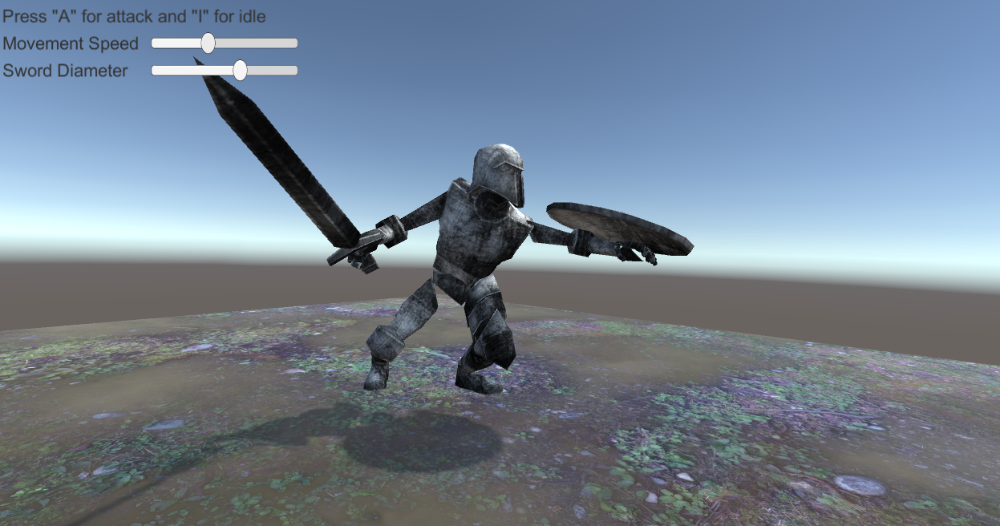

# AM22-Procedural-Audio-for-Virtual-Environments
Repository of the AudioMostly 2022 Procedural Audio for Virtual Environments Workshop.

## Workshop abstract
Sound design is a crucial aspect of interactive virtual environments (VEs). Often, this activity is fixated by the constraints of the tools we use or our perception of that medium. In this on-site workshop, we present methods to model sound-producing objects and their behaviour. In particular, participants will learn and apply procedural audio principles to leverage the experience and interaction with the virtual environment through sound.

## Software requirements
Participants can either install [Unity 2021.3.5f1](https://unity3d.com/get-unity/download/archive) and the [latest version of Pd vanilla](https://puredata.info/downloads) on their machines or use one of the local machines to participate in the workshop.
We will also use the [LibPd Unity Interagration](https://github.com/LibPdIntegration/LibPdIntegration), **which is already in this repository** (there is no need for you to download it again). 

## Links
- [Audio Mostly 2022 Conference programe](https://audiomostly.fhstp.ac.at/programme#accordion-197058-content)
- [Workshop submission](./DiDonato_Selfridge_2022.pdf)