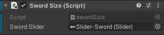

1. [Download](https://github.com/balandinodidonato/AM22-Procedural-Audio-for-Virtual-Environments/archive/refs/heads/main.zip) the the whole content of the repository.
2. Open the project in Unity 2021.3.5f1
3. Check that everything runs fine
4. Create a new empty object called "swingModelSound" and

    

    4.1. Add a "LibPd Instance" component 
    4.2. The Pd patch in the "Patch" field
    4.3. Check also the "Pipe Print To Console" box, to print incoming values in Pd.

    

5. Select the "swordTracker" game object and

    

    5.1. Open the SwordDataTracker Script and create a LibPdInstance object which will allow to send data to the pd patch; and, send the speed value to the Pure Data patch

    

    

    5.2. Link the swingModelSound PD instance to the sword]

    

6. Select the "sword01" game object and

    

    6.1. Open the SwordSize Script and create a LibPdInstance object which will allow to send data to the pd patch; and, send the speed value to the Pure Data patch

    

    

    6.2. Link the swingModelSound PD instance to the sword]

    